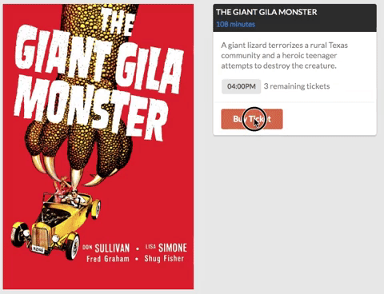

# Flatdango

Flatiron Movie Theater is open for business! You will be building out an application, Flatdango, that allows a user to purchase movie tickets from the theater.

## Demo

## Setup

- Fork and clone this repository.
- Open `index.html` in your browser.
- Run `json-server --watch db.json` to start the backend.

## Endpoints

Your base URL for your API will be: http://localhost:3000

The endpoints you will need are:

- GET `/films/[:id]` (start with `/films/1`)
- PATCH `/films/[:id]`
- GET `/films` (for Advanced Deliverables only)

## Core Deliverables

As a user, I can:

- See the first movie's details, including its **poster, title, runtime, showtime, and available tickets** (the number of tickets left will need to be derived from the theater's capacity and the number of tickets sold)
- Buy a ticket for a movie. The number of tickets sold for that movie should be persisted, and I should be able to see the number of available tickets decreasing on the frontend.
- I should not be able to buy a ticket if the showing is sold out.

## Rubric

You can find the rubric for this assessment [here](https://github.com/learn-co-curriculum/se-rubrics/blob/master/module-3.md).
